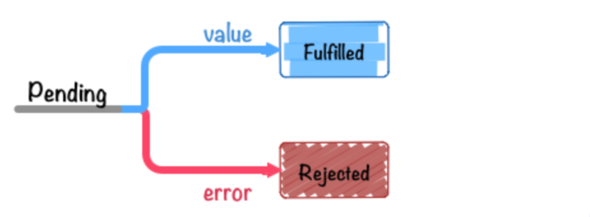

[TOC]

# 你了解Promise吗

在异步编程中，Promise扮演了举足轻重的角色，它解决了ajax请求过程中的回调地狱的问题，令代码更具可读性。下面的介绍中，会通过一些片段代码，加上一些我自己的理解带大家一起重新温故一下Promise为编程所带来的便利。

> Promise是抽象异步处理对象以及对其进行各种操作的组件。 
>
> Promise 很重要 很重要 很重要，对，要强调三遍，一定要好好掌握。

实例（假如此处你还不是很了解，没关系，先留个印象）：

~~~javascript
var promise = new Promise((resolve,reject) => {
    if(true) { resolve(100) };
    if(false) { reject('error') };
});
//使用
promise.then(value => {
    console.log(value);		//100
}).catch(error => {
    console.error(error);
});
~~~

注意⚠️：本文中的函数表达式均采用**ES6**的**箭头函数表达式**的语法，你若还不是很清楚，请自行查阅（[参考阮一峰ECMAScript 6 入门]([http://es6.ruanyifeng.com/#docs/function#%E7%AE%AD%E5%A4%B4%E5%87%BD%E6%95%B0](http://es6.ruanyifeng.com/#docs/function#箭头函数))）。

## 回调函数

刚刚我们说，Promise解决了ajax请求过程中的回调地狱的问题，那么什么是回调（函数）是什么，为什么要用到回调（函数），一起回顾一下。

> 回调函数（callback function），也被称作高阶函数。
>
> 就是把一个函数B作为**参数**（注意：是作为参数）传入“另一个函数A”中，然后这个函数B在“另一个函数A”中调用，那么这个函数B，就叫回调函数。函数A执行完以后执行函数B，这个过程就叫做回调。
>
> **注意：回调函数不是立即就执行。它是在另一个函数执行完成之后被调用，即在包含的函数体中指定的地方“回头调用”。**
>
> 也就是： A（主函数） 让 B（参数） 做事，B 做着做着，信息不够，不知道怎么做了，就需要A告诉他，这时，A到外面获取信息，待A执行完毕后拿到了所需信息，再回过头来调用B。
>
> 网上也有一个通俗易懂的例子帮助理解回调函数：
>
> 你到一个商店买东西，刚好你要的东西没有货，于是你在店员那里留下了你的电话，过了几天店里有货了，店员就打了你的电话，然后你接到电话后就到店里去取了货。在这个例子里，你的电话号码就叫回调函数，你把电话留给店员就叫登记回调函数，店里后来有货了叫做触发了回调关联的事件，店员给你打电话叫做调用回调函数，你到店里去取货叫做响应回调事件。
>
> 回调函数的使用场景：主要是需要将父函数的执行结果通知给回调函数进行处理时使用。

~~~javascript
//回调函数举例1
$("#btn").click(() => {
	alert("我是回调函数里的内容，点击后才出现，并没有立即执行");
});

//回调函数举例2
function runAsyncMain(callback){
  	callback();
    console.log('我是主函数');  
}
function runAsyncCallback(){
    setTimeout(() => {
        console.log('我是回调函数');
    }, 2000);		//此处模拟延迟加载
}
runAsyncMain(runAsyncCallback);	//（先输出）我是主函数    (2s后输出) 我是回调函数

~~~

可见此处主函数runAsyncMain执行的过程中，按顺序本应先执行回调函数，但输出结果却是后输出的回调函数内容，这说明，主函数不用等回调函数执行完再执行后续的语句，可以接着执行自己的代码，等回调函数准备好，再执行回调函数。所谓的异步加载也不过如此，当然，异步与回调并没有直接的联系，回调只是异步的一种实现方式。

## 为什么需要Promise

介绍完回调函数，要回到Promise的主场了。程序执行过程中，有非常多的应用场景我们不能立即知道应该如何继续往下执行，例如很重要的`ajax请求`。通俗来说，由于网速的不同，可能你得到返回值的<u>时间</u>也不同，这时我们就需要等某个结果出来了之后才知道怎么样继续下去，例如下方的回调函数案例：

~~~javascript
// 需求：当一个ajax结束后，得到的值，需要作为另外一个ajax的参数被使用（即该参数得从上一个ajax请求中获取）
var url = 'XXXXXX';
var result;

var XHR = new XMLHttpRequest();
XHR.open('GET', url, true);		//第一个ajax请求
XHR.send();

XHR.onreadystatechange = function() {
    if (XHR.readyState == 4 && XHR.status == 200) {
        result = XHR.response;
        console.log(result);
        // 伪代码
        var url2 = 'XXXXXX' + result.someParams;		//通过第一个ajax请求的结果，得到第二个ajax请求所需要的url
        var XHR2 = new XMLHttpRequest();
        XHR2.open('GET', url2, true);			//第二个ajax请求
        XHR2.send();
        XHR2.onreadystatechange = function() {
            ...					
            //往复上述过程，会得到第三个ajax请求所需要的url值，然后进行第三个ajax请求，在得到第四个……  超恐怖
        }
    }
}
~~~

当上述需求中出现第三个ajax（甚至更多）仍然依赖上一个请求的时候，代码就会变成一场灾难。也就是我们常说的`回调地狱`。

这时，可能会希望：

1. **让代码变得更具有可读性和可维护性，减轻一层层套用数据和请求的现象**
2. **将请求和数据处理明确的区分开**

这时`Promise`就要闪亮登场了，Promise中强大的then方法，可以解决刚刚出现的恐怖的`回调地狱`问题，并且让代码更优雅。

别急，我们先从文档中最基础的 API 入手。

## Promise的API

### 1、constructor （构造函数属性）

`Promise`本身也是一个`构造函数`，需要通过这个构造函数创建一个新的`promise`对象作为接口，使用`new`来调用`Promise`的构造器来进行实例化，所以这个实例化出来的新对象：具有constructor属性，并且指针指向他的构造函数Promise。

```javascript
var promise = new Promise((resolve, reject) => {
    // 此处代码会立即执行
    // 当调用栈内容处理结束后，再通过promise.then()方法调用resolve 或 reject返回的数据
});
```

### 2、Instance Method （实例方法）

#### <u>promise.then()</u> 

Promise对象中的`promise.then(resolve，reject)` 实例方法，可以接收构造函数中处理的状态变化，通过此方法，设置了其值在 **resolve**(成功) / **reject**(失败)时调用的回调函数，并分别对应执行。

```javascript
promise.then(onFulfilled, onRejected)
```

then方法有2个参数（都是可选参数，此参数是个回调函数）：

- resolve 成功时`onFulfilled` 会被调用
- reject 失败时`onRejected` 会被调用

`promise.then` 成功和失败时都可以使用，并且**`then方法的执行结果也会返回一个Promise对象`**。

 #### <u>promise.catch()</u>

另外在<u>只想对异常进行处理时</u>可以采用 `promise.then(undefined, onRejected)` 这种方式，只指定reject时的回调函数即可。 不过这种情况下 `promise.catch(onRejected)` 应该是个更好的选择。

~~~javascript
promise.catch(onRejected)
~~~

注意：在IE8及以下版本，使用 `promise.catch()` 的代码，会出现 **identifier not found** 的语法错误。（因为 `catch` 是ECMAScript的 [保留字](http://mothereff.in/js-properties#catch) (Reserved Word)有关。在ECMAScript 3中保留字是不能作为对象的属性名使用的。）

解决办法：不单纯的使用 `catch` ，而是使用 `then` 来避免这个问题。

\-------------------------------------------------------------------------

```javascript
//then和catch方法 举例
function asyncFunction(value) {
    var p = new Promise((resolve, reject) => {
        if(typeof(value) == 'number'){
            resolve("我是数字");
        }else {
            reject("我不是数字");
        }
    });
    return p;
}

// 写法1：同时使用then和catch方法
asyncFunction(123).then(value => {	
    console.log(value);   
}).catch(error => {
    console.log(error);
});
//执行结果：我是数字
//解说：执行过程 
// 1、在asyncFunction这个方法中创建一个Promise构造函数p，只要执行asyncFunction()就会返回一个Promise对象；
// 2、asyncFunction方法表示：如果传入的参数value值是数字，就输出"我是数字"，如果不是数字，就输出"我不是数字"
// 3、写法1中，为promise对象用设置 .then 方法调用返回值时的回调函数，.catch 方法来设置发生错误时的回调函数
// 4、promise对象会先判断resolve，并执行then方法，如果resolve执行通过，则不会执行catch方法，若上面代码在执行中产生异常，在 catch 中设置的回调函数就会被执行，并输出error。

// 写法2：只使用 then方法，不使用catch 方法
asyncFunction('abc').then((value) => {	
    console.log(value);   
},(error) => {
    console.log(error);
});
//执行结果：我不是数字

```

### 3、Static Method （静态方法）

像 `Promise` 这样的全局对象还拥有一些静态方法，后文中会有详细解释。

#### Promise.resolve()

Promise.resolve() 方法返回一个以给定值解析后的新的Promise对象，从而能继续使用then的链式方法调用。

#### Promise.reject()

Promise.reject() 方法和Promise.resolve() 方法一样。

#### Promise.all()	

Promise.all() 方法的作用是将多个`Promise`对象实例包装，生成并返回一个新的`Promise`实例。

#### Promise.race()	

Promise.race()与Promise.all()相反。

……

## Promise 的状态 <sub>(Fulfilled、Rejected、Pending)</sub>

`Promise的精髓是“状态”，用维护状态、传递状态的方式来使得回调函数能够及时调用。`

用`new Promise` 实例化的promise对象有以下三个状态。

- "unresolved" - `Pending`	|  既不是resolve也不是reject的状态。等待中，或者进行中，表示Promise刚创建，还没有得到结果时的状态
- "has-resolution" - `Fulfilled`	|  resolve(成功)时。此时会调用 `onFulfilled`
- "has-rejection" - `Rejected`	|  reject(失败)时。此时会调用 `onRejected` 


关于下面这三种状态的读法，其中 左侧为在 ES6 Promises 规范中定义的术语， 而右侧则是在 Promises/A+中描述状态的术语。



上图的意思是promise对象的状态，从*Pending*转换为*Fulfilled*或*Rejected*之后， 这个promise对象的状态就不会再发生任何变化，会一直保持这个结果。

当promise的对象状态发生变化时，用`.then` 来定义只会被调用一次的函数。

## Promise的使用

### 1、创建Promise对象

前面很多次强调，Promise本身就是一个构造函数，所以可以通过new创建新的Promise对象：

~~~javascript
var p = new Promise((resolve, reject) => {
    //做一些异步操作
    setTimeout(() => {
        console.log('执行完成');
        resolve('我的数据');
    }, 0);
    console.log("我先执行")
});
//先输出：我先执行
//1秒之后输出： 执行完成
~~~

我们执行了一个`异步操作`，也就是setTimeout，1秒后，输出“执行完成”，并且调用resolve方法。<u>但是只是new了一个Promise对象，并没有调用它，我们传进去的函数就已经执行了。为了避免这个现象产生， 所以我们用Promise的时候一般是包在一个函数中，需要的时候去运行这个函数。</u>

如果你对执行的先后顺序还不理解，推荐阅读文章[事件的循环机制（Event loop）](https://www.jianshu.com/p/12b9f73c5a4f)，前文中我们也曾多次提到异步加载，所以此概念应熟记于心。

> <sub>`异步任务`：指不进入主线程、而`进入"任务队列"（task queue）的任务`，只有等主线程任务执行完毕，"任务队列"开始通知主线程，请求执行任务，该任务才会进入主线程执行。</sub>
>
> 异步加载例如：你做壶水要冲咖啡，可是水要10分钟才能做开，此时，你转身去写了个小程序，等10分钟后水好了，才回来继续冲咖啡的活动，中间你去做了很多别的有意义的事情，也并没有耽误冲咖啡这项任务，这就是异步。
>
> <sub>也可以理解为可以改变程序正常执行顺序的操作就可以看成是异步操作。例如setTimeout和setInterval函数</sub>
>
> <sub>`同步任务`：指在主线程上排队执行的任务，只有前一个任务执行完毕，才能执行后一个任务；</sub>
>
> 同步加载例如：你做壶水要冲咖啡，可是水要10分钟才能做开，此时，你就等啊等啊等，等了10分钟水好了，才继续冲咖啡的活动，中间的过程就是等待，啥都不干，这就是同步。
>
> <sub>[推荐参考文章：彻底理解同步、异步和事件循环(Event Loop)](https://segmentfault.com/a/1190000004322358?utm_source=tag-newest)</sub>

你会发现，异步加载的举例和上文中强调的回调函数例子很像，但刚刚也强调了，异步与回调并没有直接的联系，回调只是异步的一种实现方式（再次重复 加深理解）。

你会不会以为异步像是多线程操作那样并列执行程序？我想说，千万不要这样想！js就是单线程，没有多线程一说，所以不存在并行，即便是异步，也是单线程，只不过是放在了异步队列里，对，是队列，倘若你不是很理解，那么请前去了解一下[事件循环机制中的宏任务和微任务](https://www.jianshu.com/p/12b9f73c5a4f)（promise就是微任务，settimeout是宏任务，非常不错的一篇文章）的区别，它们所在的队列是不同的，看过之后，相信你会对promise有更深刻的了解。

### 2、封装Promise对象

```javascript
function asyncFunction(num) {
    var p = new Promise((resolve, reject) => {	//创建一个Promise的新对象p
        if (typeof num == 'number') {
            resolve();
        } else {
            reject();
        }
    });
    p.then(function() {	//这个（第一个）function是resolve对应的参数
        console.log('这个是数字');
    }, function() {		//这个（第二个）function是reject对应的参数
        console.log('我不是数字');
    })
    return p;	//此处返回对象p
}

//执行这个函数我们得到了一个Promise构造出来的对象p，所以p.__proto__ === Promise.prototype，即p的指针指向了构造函数Promise，因此asyncFunction()能够使用Promise的属性和方法

//此种写法可以多次调用asyncFunction这个方法
asyncFunction('hahha');	//我不是数字
asyncFunction(1234);	//这个是数字

```

我们刚刚讲到，**`then方法的执行结果也会返回一个Promise对象`**，得到一个结果。因此我们可以进行then的链式执行，接收上一个then返回回来的数据并继续执行，这也是`解决回调地狱`的主要方式。

### 3、Promise的链式操作和数据传递

下面我们就来看看.then和.catch两个方法返回的到底是不是新的promise对象。

~~~javascript
var aPromise = new Promise(resolve => {
    resolve(100);
});// aPromise为原promise对象
// 下面分开进行.then和.catch操作
var thenPromise = aPromise.then(value => {
    console.log(value);
});
var catchPromise = thenPromise.catch(error => {
    console.error(error);
});
console.log(aPromise !== thenPromise); // => true
console.log(aPromise !== catchPromise); // => true
console.log(thenPromise !== catchPromise);// => true
~~~

`===` 是严格相等比较运算符，我们可以看出这三个对象都是互不相同的，这也就证明了 `then` 和 `catch` 都返回了和调用着不同的promise对象。我们通过下面这个例子进一步来理解：

~~~javascript
// 1: 对同一个promise对象同时调用 `then` 方法
var aPromise = new Promise(resolve => {
    resolve(100);
});
aPromise.then(value => {
    return value * 2;
});
aPromise.then(value => {
    return value * 2;
});
aPromise.then(value => {
    console.log("1: " + value); // 1: 100
})

// vs

// 2: 对 `then` 进行 promise 链式 方式进行调用
var bPromise = new Promise(resolve => {
    resolve(100);
});
bPromise.then(value => {
    return value * 2;
}).then(value => {
    return value * 2;
}).then(value => {
    console.log("2: " + value); // 2: 400
});
~~~

写法1 中并没有使用promise的方法链方式，这在Promise中是应该极力避免的写法。这种写法中的 `then` 调用几乎是在同时开始执行的，而且传给每个 `then` 方法的 `value` 值都是 `100` 。

写法2 则采用了方法链的方式将多个 `then` 方法调用串连在了一起，各函数也会严格按照 resolve → then → then → then 的顺序执行，并且传给每个 `then` 方法的 `value` 的值都是前一个promise对象通过 `return` 返回的值，实现了Promise的数据传递。

**==强调：promise的链式操作实现了数据的传递，promise非链式操作的方法无法实现数据传递。==**

### 4、通过Promise封装ajax 解决回调地狱问题

刚刚在开篇（【为什么需要Promise】 这一节），通过一个ajax的例子，引出了回调地狱的概念，强调了通过回调函数方式解决多级请求都依赖于上一级数据时所引发的问题。下面我们通过刚刚学习过的Promise内容（特别是.then的链式数据传递）对上面的ajax数据依赖的案例进行重写：

~~~javascript
var url = 'XXXXX';

// 封装一个get请求的方法
function getJSON(url) {
    return new Promise((resolve, reject) => {
        var XHR = new XMLHttpRequest();
        XHR.open('GET', url, true);
        XHR.send();

        XHR.onreadystatechange = function() {
            if (XHR.readyState == 4) {
                if (XHR.status == 200) {
                    try {
                        var response = JSON.parse(XHR.responseText);
                        resolve(response);
                    } catch (e) {
                        reject(e);
                    }
                } else {
                    reject(new Error(XHR.statusText));
                }
            }
        }
    })
}

getJSON(url)
    .then(resp => {
        console.log(response);
        return url2 = 'http:xxx.yyy.com/zzz?ddd=' + resp;
    })
    .then(resp => {
        console.log(response);
        return url3 = 'http:xxx.yyy.com/zzz?ddd=' + resp;
    });
~~~

## new Promise写法的快捷方式

 `1、Promise.resolve`

~~~javascript
new Promise(resolve => {
    resolve(100);
});
// 等价于
Promise.resolve(100);	//Promise.resolve(100); 可以认为是上述代码的语法糖。

// 使用方法
Promise.resolve(100).then(value => {
    console.log(value);
});
~~~

\--------------------------------------------------

另：`Promise.resolve` 方法另一个作用就是将 thenable 对象转换为promise对象。

ES6 Promises里提到了Thenable这个概念，简单来说它就是一个非常类似promise的东西。就像我们有时称具有 `.length` 方法的非数组对象为类数组（Array like）一样，thenable指的是一个具有 `.then` 方法的对象。

因为：类库没有提供 `Promise` 的实现，用户通过 `Promise.resolve(thenable)` 来自己实现了 `Promise`，并且，作为Promise使用的时候，需要和 `Promise.resolve(thenable)` 一起配合使用，将thenable对象转换promise对象：

```javascript
var promise = Promise.resolve($.ajax('/json/comment.json'));// => promise对象
promise.then(function(value){
   console.log(value);
});
```

在此不再对Thenable进行过多赘述，可自行了解。

\--------------------------------------------------

`2、Promise.reject`

~~~javascript
new Promise((resolve,reject) => {
    reject(new Error("出错了"));
});
// 等价于
 Promise.reject(new Error("出错了"));	// Promise.reject(new Error("出错了")) 就是上述代码的语法糖。

// 使用方法
Promise.reject(new Error("BOOM!")).catch(error => {
    console.error(error);
});
~~~

## Promise.all()

> [`Promise.all`](http://liubin.org/promises-book/#Promise.all) 接收一个 promise对象的`数组作为参数`，当这个数组里的所有promise对象全部变为resolve或reject状态的时候，它才会去调用 `.then` 方法。
>
> 也就是说：Promise的all方法提供了异步操作的能力，并且在所有异步操作执行完后才执行回调。

~~~javascript
// `delay`毫秒后执行resolve
function timerPromisefy(delay) {
    return new Promise(resolve => {
        setTimeout(() => {
            resolve(delay);
        }, delay);
    });
}
var startDate = Date.now();
// 所有promise变为resolve后程序退出
Promise.all([
    timerPromisefy(1),
    timerPromisefy(32),
    timerPromisefy(64),
    timerPromisefy(128)
]).then(values => {
    console.log(Date.now() - startDate + 'ms');
    // 约128ms
    console.log(values);    // [1,32,64,128]
});
~~~

这说明`timerPromisefy` 会每隔1, 32, 64, 128 ms都会有一个promise发生 `resolve` 行为，返回一个promise对象，状态为FulFilled，其状态值为传给 `timerPromisefy` 的参数，并且all会把所有异步操作的结果放进一个数组中传给then。

从上述结果可以看出，传递给 [`Promise.all`](http://liubin.org/promises-book/#Promise.all) 的promise并不是一个个的顺序执行的，而是`同时开始、并行执行`的。

## Promise.race()

> all方法的效果实际上是「谁跑的慢，以谁为准执行回调」，那么相对的就有另一个方法「谁跑的快，以谁为准执行回调」，这就是race方法，这个词本来就是赛跑的意思。race的用法与all一样，接收一个promise对象数组为参数。
>
> `Promise.all` 在接收到的所有的对象promise都变为 FulFilled 或者 Rejected 状态之后才会继续进行后面的处理， 与之相对的是 `Promise.race` 只要有一个promise对象进入 FulFilled 或者 Rejected 状态的话，就会继续进行后面的处理。

~~~javascript
// `delay`毫秒后执行resolve
function timerPromisefy(delay) {
    return new Promise(resolve => {
        setTimeout(() => {
            resolve(delay);
        }, delay);
    });
}
// 任何一个promise变为resolve或reject 的话程序就停止运行
Promise.race([
    timerPromisefy(1),
    timerPromisefy(32),
    timerPromisefy(64),
    timerPromisefy(128)
]).then(function (value) {
    console.log(value);    // => 1
});
~~~

上面的代码创建了4个promise对象，这些promise对象会分别在1ms，32ms，64ms和128ms后变为确定状态，即FulFilled，并且在第一个变为确定状态的1ms后， `.then` 注册的回调函数就会被调用，这时候确定状态的promise对象会调用 `resolve(1)` 因此传递给 `value` 的值也是1，控制台上会打印出`1`来。

-----

promise的基本使用原理以及它在实际应用中为我们解决的问题，在上述过程中已经介绍完了，你是否理解了呢？学习是一个反复阅读，反复加深印象的过程，加油牢牢掌握这一知识点，在vue、react等框架的使用中，也会频繁用到有关promise的知识，下面一起来检测一下对promise的认知结果吧。

---

## 小练习

下面内容的输出结果应该是啥？

~~~javascript
function test1() {
    console.log("test1");
}
function test2() {
    console.log("test2");
}
function onRejected(error) {
    console.log("捕获错误: test1 or test2", error);
}
function test3() {
    console.log("end");
}

var promise = Promise.resolve();
promise
    .then(test1)
    .then(test2)
    .catch(onRejected)
    .then(test3);
~~~

温馨提示：这里没有为 `then` 方法指定第二个参数(onRejected)

## 补充1：对比 callback → Promise → async/await

javascript的异步发展历程，从callback，到Promise对象、Generator函数，在不停的优化程序上的编写方式，但又让人觉得不是很彻底，随即又有了之后的async/await的异步编程方式，让异步编程变得更像同步代码，增强了代码的可读性，甚至很多人评价async/await是异步操作的终极解决方案，接下来简单介绍一下这三种方式各自的优缺点：

1. **callback（回调）**：本文开篇也提及了回调函数虽然好理解，但只对于简单的异步程序，callback是可以胜任的，但是在ajax需要被多次调用时使用起来会产生很多问题：

   - 高耦合，让程序变得难以维护；
   - 并且错误捕捉要通过人工的设置判断来进行；

2. **Promise**：ES6提供的构造函数Promise的实现是要基于callback的，解决了异步执行的问题。

   - 通过Promise.then()链式调用的方法，解决了回调函数层层嵌套（回调地狱）的问题，让代码和操作都变得更加简洁；
   - 可以统一通过Promise.catch()方法对异常进行捕获，无需再像callback那样，为每个异步操作添加异常处理；
   - Promise.all()方法可以对异步操作进行并行处理，同时执行多个操作；

   但Promise也存在缺点：

   - 当处于未完成状态时，无法确定目前处于哪一阶段；
   - 如果不设置回调函数，Promise内部的错误不会反映到外部；
   - Promise一旦新建它就会立即执行，无法中途取消；

   ES6中，还有一个**Generator**函数，以前一个函数中的代码要么被调用，要么不被调用，不存在能暂停的情况，Generator函数让代码可以中途暂停、异步执行，它与Promise的结合使用，类似于 async/await（见下文） 效果的代码。

   整个 Generator 函数就是一个封装的异步任务的容器，他的语法是在函数名前加个*号，在异步操作需要暂停的地方，都用 yield 语句注明，但仅有yield，函数是不会执行的，他需要调用next方法，指针都会向下移一个状态，直到遇到下一个`yield`表达式（或`return`语句）为止。

3. **async/await**：ES7中新增的异步编程方法 async/await 的实现是基于 Promise的，简单来说就是 **async function 就是返回 Promise 的 function，是generator的语法糖，其实async 函数就是将 Generator 函数的星号（*）替换成 async，将 yield 替换成 await**。很多人认为async/await是异步操作的终极解决方案：

   - 它改进 JS 中异步操作串行执行的代码组织方式，减少 callback 的嵌套；
   - 语法简介，更像是同步代码，也更符合普通的阅读习惯；
   - Promise 中不能自定义使用 try/catch 进行错误捕获，但是在 Async/await 中可以像处理同步代码处理错误；

综上是**异步编程**的演变过程，**它语法目标，其实就是怎样让它更像同步编程。**

如果你想要更详细的了解Generator和async／await异步操作方式，请查阅MDN中的相关文档。同时推荐一篇通俗易懂的文章：https://www.lazycoffee.com/articles/view?id=58ab09eea072b332753d9774 

## 补充2：Promise 的实现原理

一起回顾一下， 文章介绍了promise的来由、解决的问题、常用和重点的方法，以及promise的使用方法和应用场景，你是不是也很好奇，没有promise的话，我们要如何模拟出promise呢？也就是，promise是如何实现的？

回顾一下Promise的使用过程：

1. 首先要知道，Promise对象有三个状态：`Pending(进行中)`、`Fulfilled(已成功)`、`Rejected(已失败)`，所以需要Promise设置三个状态值；
2. Promise存在resolve和reject两个回调函数作为自身参数：new Promise((resolve, reject){});  ，通过判断步骤1中的三个状态值，来确定输出哪个方法，例如：
   - promise处于Fulfilled状态时，就输出resolve对应的方法；
   - Rejected状态时就输出reject方法；
3. Promise的then方法要接收两个参数：promise.then(onFulfilled, onRejected)，onFulfilled和onRejected也必须是两个函数
   - 当Promise的状态为成功时，调用onFulfilled这个方法，其中onFulfilled方法中的参数是步骤2中promise成功状态 resolve执行时传入的值；
   - 当Promise的状态为失败时，调用onRejected这个方法，其中onRejected方法中的参数是步骤2中promise失败状态 reject执行时传入的值；
4. 如果then被同一个Promise多次调用，所有 `onFulfilled`和 `onRejected`  需按照其注册顺序依次回调；
5. ……
6. 当然，Promise还有.catch、.all、.race等很多方法，以及基本逻辑和规则确定后，还需要加上错误捕获、值传递等逻辑和安全机制，例如判断步骤2中的回调函数是否为function、步骤4链式操作中，then返回的是否为一个新的Promise对象等等。

具体的Promise实现原理代码如下，若有兴趣的童鞋可参考阅读，帮助进一步加深理解：

```javascript
// 判断变量否为function
  const isFunction = variable => typeof variable === 'function'
  // 定义Promise的三种状态常量
  const PENDING = 'PENDING'
  const FULFILLED = 'FULFILLED'
  const REJECTED = 'REJECTED'

  class MyPromise {
    constructor (handle) {
      if (!isFunction(handle)) {
        throw new Error('MyPromise must accept a function as a parameter')
      }
      // 添加状态
      this._status = PENDING
      // 添加状态
      this._value = undefined
      // 添加成功回调函数队列
      this._fulfilledQueues = []
      // 添加失败回调函数队列
      this._rejectedQueues = []
      // 执行handle
      try {
        handle(this._resolve.bind(this), this._reject.bind(this)) 
      } catch (err) {
        this._reject(err)
      }
    }
    // 添加resovle时执行的函数
    _resolve (val) {
      const run = () => {
        if (this._status !== PENDING) return
        // 依次执行成功队列中的函数，并清空队列
        const runFulfilled = (value) => {
          let cb;
          while (cb = this._fulfilledQueues.shift()) {
            cb(value)
          }
        }
        // 依次执行失败队列中的函数，并清空队列
        const runRejected = (error) => {
          let cb;
          while (cb = this._rejectedQueues.shift()) {
            cb(error)
          }
        }
        /* 如果resolve的参数为Promise对象，则必须等待该Promise对象状态改变后,
          当前Promsie的状态才会改变，且状态取决于参数Promsie对象的状态
        */
        if (val instanceof MyPromise) {
          val.then(value => {
            this._value = value
            this._status = FULFILLED
            runFulfilled(value)
          }, err => {
            this._value = err
            this._status = REJECTED
            runRejected(err)
          })
        } else {
          this._value = val
          this._status = FULFILLED
          runFulfilled(val)
        }
      }
      // 为了支持同步的Promise，这里采用异步调用
      setTimeout(run, 0)
    }
    // 添加reject时执行的函数
    _reject (err) { 
      if (this._status !== PENDING) return
      // 依次执行失败队列中的函数，并清空队列
      const run = () => {
        this._status = REJECTED
        this._value = err
        let cb;
        while (cb = this._rejectedQueues.shift()) {
          cb(err)
        }
      }
      // 为了支持同步的Promise，这里采用异步调用
      setTimeout(run, 0)
    }
    // 添加then方法
    then (onFulfilled, onRejected) {
      const { _value, _status } = this
      // 返回一个新的Promise对象
      return new MyPromise((onFulfilledNext, onRejectedNext) => {
        // 封装一个成功时执行的函数
        let fulfilled = value => {
          try {
            if (!isFunction(onFulfilled)) {
              onFulfilledNext(value)
            } else {
              let res =  onFulfilled(value);
              if (res instanceof MyPromise) {
                // 如果当前回调函数返回MyPromise对象，必须等待其状态改变后在执行下一个回调
                res.then(onFulfilledNext, onRejectedNext)
              } else {
                //否则会将返回结果直接作为参数，传入下一个then的回调函数，并立即执行下一个then的回调函数
                onFulfilledNext(res)
              }
            }
          } catch (err) {
            // 如果函数执行出错，新的Promise对象的状态为失败
            onRejectedNext(err)
          }
        }
        // 封装一个失败时执行的函数
        let rejected = error => {
          try {
            if (!isFunction(onRejected)) {
              onRejectedNext(error)
            } else {
                let res = onRejected(error);
                if (res instanceof MyPromise) {
                  // 如果当前回调函数返回MyPromise对象，必须等待其状态改变后在执行下一个回调
                  res.then(onFulfilledNext, onRejectedNext)
                } else {
                  //否则会将返回结果直接作为参数，传入下一个then的回调函数，并立即执行下一个then的回调函数
                  onFulfilledNext(res)
                }
            }
          } catch (err) {
            // 如果函数执行出错，新的Promise对象的状态为失败
            onRejectedNext(err)
          }
        }
        switch (_status) {
          // 当状态为pending时，将then方法回调函数加入执行队列等待执行
          case PENDING:
            this._fulfilledQueues.push(fulfilled)
            this._rejectedQueues.push(rejected)
            break
          // 当状态已经改变时，立即执行对应的回调函数
          case FULFILLED:
            fulfilled(_value)
            break
          case REJECTED:
            rejected(_value)
            break
        }
      })
    }
    // 添加catch方法
    catch (onRejected) {
      return this.then(undefined, onRejected)
    }
    // 添加静态resolve方法
    static resolve (value) {
      // 如果参数是MyPromise实例，直接返回这个实例
      if (value instanceof MyPromise) return value
      return new MyPromise(resolve => resolve(value))
    }
    // 添加静态reject方法
    static reject (value) {
      return new MyPromise((resolve ,reject) => reject(value))
    }
    // 添加静态all方法
    static all (list) {
      return new MyPromise((resolve, reject) => {
        /**
         * 返回值的集合
         */
        let values = []
        let count = 0
        for (let [i, p] of list.entries()) {
          // 数组参数如果不是MyPromise实例，先调用MyPromise.resolve
          this.resolve(p).then(res => {
            values[i] = res
            count++
            // 所有状态都变成fulfilled时返回的MyPromise状态就变成fulfilled
            if (count === list.length) resolve(values)
          }, err => {
            // 有一个被rejected时返回的MyPromise状态就变成rejected
            reject(err)
          })
        }
      })
    }
    // 添加静态race方法
    static race (list) {
      return new MyPromise((resolve, reject) => {
        for (let p of list) {
          // 只要有一个实例率先改变状态，新的MyPromise的状态就跟着改变
          this.resolve(p).then(res => {
            resolve(res)
          }, err => {
            reject(err)
          })
        }
      })
    }
    finally (cb) {
      return this.then(
        value  => MyPromise.resolve(cb()).then(() => value),
        reason => MyPromise.resolve(cb()).then(() => { throw reason })
      );
    }
  }

// 源码链接：https://juejin.im/post/5b83cb5ae51d4538cc3ec354
```

## 参考

[1].阮一峰ECMAScript 6入门(http://es6.ruanyifeng.com/#docs/function#箭头函数)

[2].保留字(http://mothereff.in/js-properties#catch)

[3].事件的循环机制(Event loop)(https://www.jianshu.com/p/12b9f73c5a4f)~~

[4].彻底理解同步、异步和事件循环(Event Loop)(https://segmentfault.com/a/1190000004322358?utm_source=tag-newest) (https://developer.mozilla.org/zh-CN/docs/Web/JavaScript/EventLoop)

[5].JavaScript Promise迷你书(http://liubin.org/promises-book/)

[6].透彻掌握Promise的使用(https://www.jianshu.com/p/fe5f173276bd)


