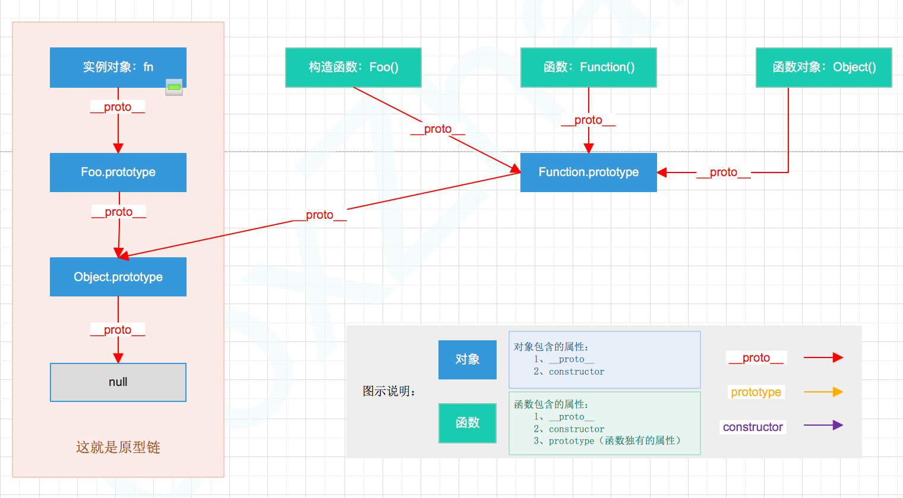

[TOC]

# 解析`prototype`、`__proto__`、`constructor`

陆陆续续看了很多关于`prototype`、`__proto__`与`constructor`属性的书籍和博文，想要更通透的了解这三个属性的关联和用途，从而更好的掌握原型链的原理。对我而言，知识总会在不经意间从大脑中遗失，所以往复回顾成了我成长过程中的永久性治疗方式，而学习技术也的确就是个巩固而知新的过程，希望这篇文章能够和大家一起分享我对**原型链**中`prototype`、`__proto__`与`constructor`这三个属性的认知，耐心来阅读吧。

 （注意：文中**\_\_proto\_\_**属性的两边是各由两个下划线构成。规范中用 [[Prototype]] 表示对象隐式的原型，在 JavaScript 中用 **\_\_proto\_\_ **表示）

---

在正式开始介绍之前，先来回顾一下几个概念：

> **【构造函数】**：
>
> ​	用来初始化新创建的对象的函数是构造函数。
>
> ​	下面案例中的**Foo()**就是构造函数。
>
> **【实例对象】**：
>
> ​	通过构造函数的**new**，创建出来的对象是实例对象，一个构造函数可以创建多个实例对象。
>
> ​	下面案例中的 **fn**，就是实例对象。
>
> **【原型和原型对象】**：
>
> ​	prototype就是原型，让所有对象实例共享原型对象所包含的属性和方法，是函数所独有的属性。
>
> ​	Foo.prototype就是原型对象，它包含了可以被通过同一歌构造函数创建的所有实例共享的属性和方法。
>
> ​	继承就是通过原型对象来实现的。

简单了解一下**原型链**中`prototype`、`__proto__`与`constructor`这三个属性，有助于下面内容的理解，文章末尾我们再进行更具体的总结：

- **\_\_proto\_\_ **是每个对象都有的**属性**，而实例化对象都是构造函数创建出来的，**对象的\_\_proto\_\_属性都指向自身构造函数的prototype**，也就是原型对象
- **prototype **是每个**构造函数**都有的一个**方法**，方法也是对象，所以也拥有\_\_proto\_\_属性
- **constructor **是对象才拥有的**属性**，指向自身的构造函数

---

本文通过下面一个简单的例子展开对**原型链**中`prototype`、`__proto__`与`constructor`的讨论**请仔细阅读注释内容**，并配以相关的图帮助理解：

~~~javascript
//看看案例吧
function Foo() {	//创建一个函数Foo
    this.name="小明";
};	
var fn = new Foo();		//通过new关键字，实例化Foo这个构造函数，得到实例化对象f1

// 打印出来，看看都是啥
console.log(fn.prototype);		//undefined，可见由构造函数创建出的对象没有prototype属性，但是有__proto__属性
console.log(Foo.prototype);		//{constructor: ƒ Foo(...), __proto__: Object}
console.log(fn.__proto__);		//{constructor: ƒ Foo(...), __proto__: Object} fn.__proto__指向构造函数的prototype
console.log(Foo.__proto__);		//ƒ () { [native code] } 指向了Foo的原型对象Function，大家可以尝试一下Function.prototype是什么结果
console.log(fn.constructor);	//ƒ Foo() {this.name="小明"}	对象的constructor用于返回创建这个对象的函数（即构造函数）
console.log(Foo.constructor);	//ƒ Function() { [native code] } Foo也是一个对象，它的构造函数是Function()，所以返回的也是Function()，而Function()较特殊，它的构造函数是他自己，下文会再次强调
console.log(Foo.prototype.constructor);	//ƒ Foo() {this.name="小明"}
console.log(Foo.prototype.__proto__);	//{constructor: ƒ, __defineGetter__: ƒ, __defineSetter__: ƒ, hasOwnProperty: ƒ, __lookupGetter__: ƒ, …}

//下面来看看Function和Object打印出来的东西分别是啥
console.log(Function.constructor);	//ƒ Function() { [native code] } 
console.log(Function.__proto__);	//ƒ () { [native code] }
console.log(Function.prototype);	//ƒ () { [native code]

console.log(Object.constructor);	//ƒ Function() { [native code] } 
console.log(Object.__proto__);	//ƒ () { [native code] }
console.log(Object.prototype);	//{constructor: ƒ, __defineGetter__: ƒ, __defineSetter__: ƒ, hasOwnProperty: ƒ, __lookupGetter__: ƒ, …}

~~~

> 【插入小广告--科普小知识】
>
> [**foobar**](<https://zh.wikipedia.org/zh-cn/Foobar>)是计算机程序领域里的术语，并无实际用途和参考意义。在计算机程序设计与计算机技术的相关文档中，术语**foobar**是一个常见的**无名氏**化名，常被作为**伪变量**使用。
>
> 单词“foobar”或分离的“**foo**”与“**bar**”常出现于程序设计的案例中，如同[Hello World](https://zh.wikipedia.org/wiki/Hello_World)程序一样，它们常被用于向学习者介绍某种程序语言。**“foo”、“bar” 常被作为函数 或 方法的名称或变量名。**

可能这样看并不能很直观的看他们分别打印出内容的相同和不同之处，下面列个表格，再来观察一下：

| 打印出的值                                         | 通过console.log()得出相同值的对象属性                        | 结论                                                         |
| -------------------------------------------------- | ------------------------------------------------------------ | ------------------------------------------------------------ |
| undifined                                          | fn.prototype                                                 | `实例化的对象没有prototype`                                  |
| { constructor: ƒ Foo(...), \_\_proto\_\_: Object } | fn.\__proto\_\_  Foo.prototype                          | 实例化对象的\__proto\_\_  和构造函数的prototype值相同        |
| ƒ () { [native code] }                             | Foo.\__proto\_\_ `Function.prototype` `Function.__proto__` `Object.__proto__` | 构造函数的\__proto\_\_  和 它的原型对象Fucntion的\_\_proto\_\_  、以及Function的prototype值相同 |
| ƒ Foo() {this.name="小明";}                        | Foo.prototype.constructor fn.constructor                | 实例化对象的constructor，和构造函数原型上的constructor 值一样 |
|                                                    |                                                              |                                                              |
| {constructor: ƒ, \_\_defineGetter\_\_: ƒ,  …}      | Foo.prototype.\_\_proto\_\_ `Function.prototype.__proto__` `Object.prototype` | 构造函数的prototype的\_\_proto\_\_ ，和它的原型对象Function上prototype的\_\_proto\_\_一致 |
| ƒ Function() { [native code] }                     | Foo.constructor `Function.constructor` `Object.constructor` | 构造函数的constructor ，和它的原型对象Function的constructor一致 |

根据表格中的对比关系，我们可以粗略推断出，由于Function是所有函数的鼻祖，所以：

1. Function的特殊性导致，它的构造函数是他自己，也就是说Function是被自身构造出来的，所以它constructor的指向也是自己
2. 构造函数Foo 的指针指向 Function
3. 实例化对象fn 的指针指向构造函数Foo

原型这错综复杂的关系，还是用画图来更直观的理解吧：

首先，我们需要牢记：

 	1. `__proto__`和`constructor`属性是`对象所独有`的；
 	2. 每个对象的`__proto__`都指向自身构造函数的`prototype`
 	3.  `prototype`属性是`函数所独有`的。

但是由于JS中`函数也是一种对象`，所以函数也拥有``__proto__``和``constructor``属性，这点是致使我们产生困惑的很大原因之一。

例如 获取图中Foo函数的\_\_proto\_\_和constructor：Foo.prototype.\_\_proto\_\_;   Foo.prototype.constructor;

上图有点复杂，我们把它按照属性分别拆分开，然后进行分析： 

## \_\_proto\_\_属性

`__proto__`属性的特性：

1. 是每个对象都有的属性，其中
2. 可以看到`__proto__`属性都是由**`一个对象指向一个对象`**，即指向它们的`原型对象`（也可以理解为父对象）。
3. **\_\_proto\_\_ **是每个对象都有的**属性**，而实例化对象都是构造函数创建出来的，**对象的\_\_proto\_\_属性都指向自身构造函数的prototype**，也就是原型对象

那么`__proto__`属性的作用是什么呢？

它的`作用`就是当访问一个对象的属性时，如果该对象内部不存在这个属性，那么就会去它的`__proto__`属性所指向的那个对象（可以理解为父对象）里找，如果父对象也不存在这个属性，则继续往父对象的`__proto__`属性所指向的那个对象（可以理解为爷爷对象）里找，如果还没找到，则继续往上找….直到原型链顶端**`null`**（可以理解为原始人。。。），此时若还没找到，则返回`undefined`（可以理解为，再往上就已经不是“人”的范畴了，找不到了，到此为止），由以上这种通过`__proto__`属性来连接对象直到`null`的一条链即为我们所谓的**`原型链`**。

## prototype 属性

`prototype`属性，别忘了一点，就是我们前面提到要牢记的两点中的第二点：

​	① `函数所独有的`

​	② 它是从`一个函数指向一个对象`。

它的**含义**是`函数的原型对象`，也就是这个函数（其实所有函数都可以作为构造函数）所创建的实例的原型对象，由此可知：`f1.__proto__ === Foo.prototype`，它们两个完全一样。

那`prototype`属性的`作用`又是什么呢？

它的`作用`就是**`包含可以由特定类型的所有实例共享的属性和方法，也就是让该函数所实例化的对象们都可以找到公用的属性和方法`**。

## constructor 属性

 

`constructor`属性也是对象才拥有的，它是从`一个对象指向一个函数`，**含义**就是`指向该对象的构造函数`，每个对象都有构造函数，从图中可以看出**`Function`**这个对象比较特殊，它`的构造函数就是它自己`（因为Function可以看成是一个函数，也可以是一个对象），所有函数最终都是由Function()构造函数得来，所以`constructor`属性的终点就是**`Function()`**。

实例对象fn是通过构造函数Foo()的new操作创建的。构造函数Foo()的原型对象是Foo.prototype，实例对象f1通过\_\_proto\_\_属性也指向原型对象Foo.prototype。

实例对象f1本身并没有constructor属性，但它可以继承原型对象Foo.prototype的constructor属性

对象的constructor属性用于返回创建该对象的函数，也就是我们常说的构造函数。

——————————————————————

总结一下： 

1. 我们需要牢记两点：

   ①`__proto__`和`constructor`属性是对象所独有的；

   ② `prototype`属性是函数所独有的，因为函数也是一种对象，所以函数也拥有`__proto__`和`constructor`属性。

2. `__proto__`属性的作用就是当访问一个对象的属性时，如果该对象内部不存在这个属性，那么就会去它的`__proto__`属性所指向的那个对象（父对象）里找，一直找，直到`__proto__`属性的`终点null`，然后返回undefined，通过`__proto__`属性将对象连接起来的这条链路即我们所谓的**`原型链`**。

3. `prototype`属性的作用就是让该函数所实例化的对象们都可以找到公用的属性和方法，即`f1.__proto__ === Foo.prototype`。

4. `constructor`属性的含义就是`指向该对象的构造函数`，所有函数（此时看成对象了）最终的构造函数都指向`终点Function()`。

下面根据上述内容整理相关的表格如下：

|          | `__proto__`                                                  | `constructor`                            | `prototype`                                                  |
| -------- | ------------------------------------------------------------ | ---------------------------------------- | ------------------------------------------------------------ |
| 属性归属 | **对象**独有                                                 | **对象**独有                             | **函数**独有（由于函数也是对象，所以函数也拥有`__proto__`和`constructor`属性） |
| 含义     | 指向它们的原型对象（也可以理解为父对象），最终指向null，实现了原型链 | 指向该对象的构造函数，最终指向Function() | 函数的原型对象                                               |
| 指向     | **一个对象指向一个对象**                                     | **一个对象指向一个函数**                 | **一个函数指向一个对象**                                     |
| 作用     | 作为原型链的桥梁，帮助向上一层层找到被访问对象的属性，直到null | 返回对创建此对象的函数的引用             | 包含可以由特定类型的所有实例`共享`的属性和方法，也就是让该函数所实例化的对象们都可以找到公用的属性和方法。 |

## 帮助理解

### 帮助理解  \_\_proto\_\_ 和 prototype

~~~javascript
function Fun(){};	//创造了一个函数Fun,这个函数由Function生成（Function作为构造函数）
var fn=new Fun();	//创建了一个函数fn,这个函数由Fn生成（Fn作为构造函数) 
console.log(fn.__proto__===Fun.prototype)    //true
// fn的__proto__指向其构造函数Fun的prototype
console.log(Fun.__proto__===Function.prototype)        //true
// Fun的__proto__指向其构造函数Function的prototype
console.log(Function.__proto__===Function.prototype)    //true
// Function的__proto__指向其构造函数Function的prototype
// 构造函数自身是一个函数，他是被自身构造的
console.log(Function.prototype.__proto__===Object.prototype)    //true
// Function.prototype的__proto__指向其构造函数Object的prototype
// Function.prototype是一个对象,同样是一个方法,方法是函数,所以它必须有自己的构造函数也就是Object
console.log(Fun.prototype.__proto__===Object.prototype)         //true
// 与上条相同
// 此处可以知道一点,所有构造函数的的prototype方法的__都指向__Object.prototype(除了....Object.prototype自身)
console.log(Object.__proto__===Function.prototype)        //true
// Object作为一个构造函数(是一个函数对象!!函数对象!!),所以他的__proto__指向Function.prototype
console.log(Object.prototype.__proto__===null)        //true
// Object.prototype作为一切的源头,他的__proto__是null

// 下面是一个新的,额外的例子
var obj={}
// 创建了一个obj
console.log(obj.__proto__===Object.prototype)        //true
// obj作为一个直接以字面量创建的对象，所以obj__proto__直接指向了Object.prototype，而不需要经过Function了！！

// 下面是根据原型链延伸的内容
// 还有一个上文并未提到的constructor,  constructor在原型链中,是作为对象prototypr的一个属性存在的,它指向构造函数（由于主要讲原型链，这个就没在意、）；
console.log(obj.__proto__.__proto__ === null)        //true
console.log(obj.__proto__.constructor === Object)        //true
console.log(obj.__proto__.constructor.__proto__===Function.prototype)        //true
console.log(obj.__proto__.constructor.__proto__.__proto__===Object.prototype)    //true    
console.log(obj.__proto__.constructor.__proto__.__proto__.__proto__===null)        //true
console.log(obj.__proto__.constructor.__proto__.__proto__.constructor.__proto__===Function.prototype)    //true
~~~

### 帮助理解 constructor和prototype

刚刚有说，`constructor`属性是对象才拥有的，它是从`一个对象指向一个函数`，**含义**就是`指向该对象的构造函数`。

`prototype`属性是`函数所独有`的，是函数的原型对象，是由一个函数指向一个对象。

按照javascript的说法，function定义的方法就是一个Object(对象)，而且还是一个很特殊的对象，这个使用function定义的对象与使用new操作符生成的对象之间有一个重要的区别。就是function定义的对象有一个prototype属性，`使用new生成的对象就没有这个prototype属性`。

prototype属性又指向了一个prototype对象，注意prototype属性与prototype对象是两个不同的东西，要注意区别。在prototype对象中又有一个constructor属性，这个constructor属性同样指向一个constructor对象，而这个constructor对象恰恰就是这个function函数本身。

有点晕么？请看下图：

~~~javascript
function Person(name){  
   this.name=name;  
   this.showMe=function(){  
       alert(this.name);  
   }  
};  
var one=new Person('js');  

console.log(one.prototype);	//undefined  证明了one这个对象没有prototype属性
console.log(typeof Person.prototype);	//object  
console.log(Person.prototype.constructor);	//function Person(name) {...}; 
console.log(one.constructor);	//function Person(name) {...}; 
~~~

## 巩固

练习：下面自己动手画一画这段代码的原型图：

~~~javascript
function SuperType(){
        this.property = true;
}
SuperType.prototype.getSuperValue = function(){
    return this.property;
};
function SubType(){
    this.subproperty = false;
}
//继承了 SuperType
SubType.prototype = new SuperType();
SubType.prototype.getSubValue = function (){
    return this.subproperty;
};
var instance = new SubType();
alert(instance.getSuperValue());
//true

~~~

~~~javascript
function People(name) {
    this.name = name;
    this.sayName = function() {
        console.log('my name is:' + this.name);
    }
}

People.prototype.walk = function() {
    console.log(this.name + 'is walking');
}

var p1 = new People('小明');
var p2 = new People('小明');
~~~

练习：创建一个 Car 对象，拥有属性name、color、status；拥有方法run，stop，getStatus

~~~javascript
function Car(name, color, status) {
    this.name = name;
    this.color = color;
    this.status = status;
}
Car.prototype = {
    constructor : Car,
    run: function() {
        this.status = 'run';
    },
    stop: function() {
        this.status = 'stop';
    },
    getStatus: function() {
        console.log(this.status);
    }
}

var car1 = new Car('BMW', 'red', 'stop');

~~~

## 参考

 本文内容均参考自以下文章（以便追根溯源）： 

<https://www.cnblogs.com/xiaohuochai/p/5721552.html> 

https://www.ibm.com/developerworks/cn/web/1306_jiangjj_jsinstanceof/index.html

https://blog.csdn.net/cc18868876837/article/details/81211729

https://www.cnblogs.com/libin-1/p/6014925.html

https://developer.mozilla.org/zh-CN/docs/Web/JavaScript/Reference/Classes/constructor

https://www.cnblogs.com/zjunet/p/4559895.html