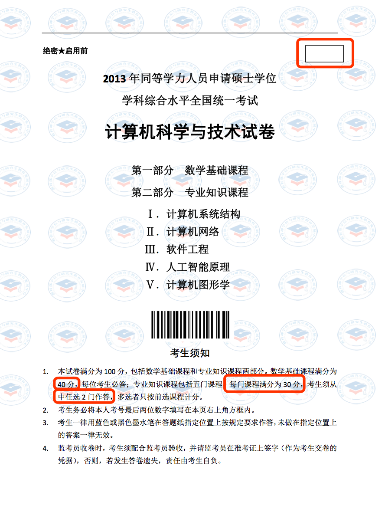

##人民大学考试

### 题库考试

全部课程闭卷考试，其中：

- 题库课考试由研究生院组织，获得考试资格卡后，每年两次可申请考试科目；题库考试后试卷经研究生院整理加密后，学院组织评卷，评卷后试卷交回研究生院，研究生院录入成绩（注：可根据自己的时间及复习情况，选择所报科目）。
- 题库考试时间：每年两次，通常为每年的三月报名，四月考试；和每年的九月报名，十月考试。
- 题库考试报名网址：http://grs.ruc.edu.cn/tdxl/sqxwks.htm；
- 打印选课通知单，明晰报考科目及具体考试时间。
- 考试时限：从提出办理考试资格卡申请，并通过研究生院审核后算起，四年有效，有效期内不通过者可申请重考。  

###非题库考试

- 非题库课考试由信息学院组织，授课结束后学期末安排考试。
- 考试成绩下一个学期的期初公布。

### 国考

1. 外国语水平考试：英语。
2. 学科综合水平考试：
   - 计算机应用技术专业：计算机科学与技术学科综合；
   - 分别有国家统一出版的考试大纲。
3. 考试时间及有效期限：
   - **报名时间**：每年3月。
   - **考试时间**：每年5月底。
   - **报名网址**：http://www.chinadegrees.cn/tdxlsqxt
   - **报名条件**：已经办理了课程学校考试资格卡，且在http://www.chinadegrees.cn/tdxlsqxt提交了个人基本信息及电子照片；以及来学院进行现场指纹采集、图像采集、信息表确认3项工作。
   - **有效期限**：在考试资格卡有效期四年内通过两门全国统考即可，四年有四次考试机会。
4. 国考考试科目：
   - 第一部分 数学基础课程（40分）
   - 第二部分 专业知识课程（共60分，30分／科，五选二，多选者只按前选课程计分）
     - I.计算机系统结构
     - II.计算机网络
     - III.软件工程
     - IV.人工智能原理
     - V.计算机图形学

### 考试缴费

1. 一次性缴纳考试费：
   - 计算机应用技术专业：课程科目数16*250元/科；
   - 管理科学与工程专业：课程科目数17*250元/科；
   - 考试资格卡申请费：200元；
2. 考试未通过者，在下次考试前先缴纳未合格科目的考试费用才能继续进行考试；补考：250元／科
3. 缴费时间：三月中旬和九月中旬（具体查看学校网站及info.ruc.edu.cn学院网站通知），资格卡申请审核通过后；
4. 缴费地点：具体查看学校网站及info.ruc.edu.cn网站通知；
5. 携带资料：携带事先下载的交费通知单。

###考试科目：

| 非题库考试科目（人大组织） | 题库考试科目（研究生院组织 闭卷）            | 国考科目             |
| -------------------------- | -------------------------------------------- | :------------------- |
| 自然辩证法-1               | 中国特色社会主义理论与实践-2                 | 英语                 |
| **专业外语-3**             | 软件工程-3                                   | 数学基础课程         |
| 运筹学-3                   | 网络与通讯-4                                 | 数学基础课程（40分） |
| 计算机理论导论-3           | DBMS原理与设计（数据库管理系统原理与实现）-4 | 专业知识课程（60分） |
| 高级操作系统-4             |                                              | I.计算机系统结构     |
| 软件过程改进-2             |                                              | II.计算机网络        |
| 数据仓库与数据挖掘-3       |                                              | III.软件工程         |
| 商务智能-3                 |                                              | IV.人工智能原理      |
| **组合数学-2**             |                                              | V.计算机图形学       |
| **离散数学-2**             |                                              |                      |
| 项目管理-2                 |                                              |                      |
| 学术规范和论文写作-2       |                                              |                      |

